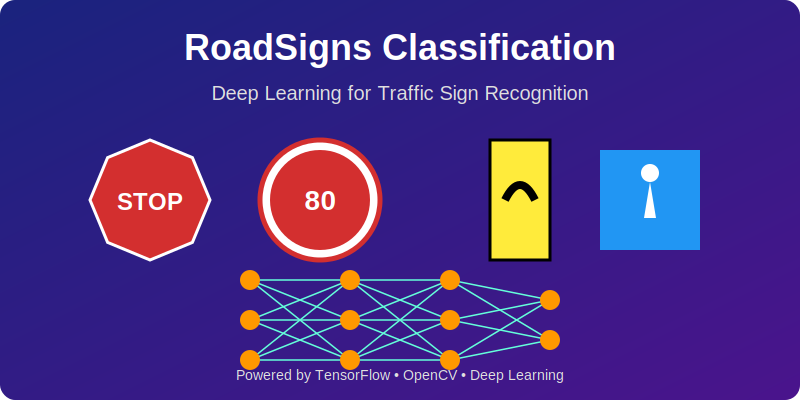

## RoadSigns Classification API

<div align="center">




**Intelligent Road Sign Classification with Deep Learning**

**Advanced neural network model for accurate and efficient traffic sign recognition and classification**

</div>

:star2: Overview

RoadSigns Classification API is a cutting-edge machine learning solution designed to help transportation engineers, autonomous vehicle developers, and traffic safety researchers with accurate, real-time classification of road signs from images. Built with TensorFlow and powered by convolutional neural networks, this tool bridges the gap between computer vision technology and practical transportation applications.

## :gear: Key Features
  
- **:rocket: High Accuracy**: State-of-the-art classification performance on standard traffic sign datasets
- **:microscope: Explainable AI**: Visualization techniques to understand model decisions and attention areas
- **:abacus: Advanced Architecture**: Deep convolutional neural networks optimized for visual pattern recognition
- **:art: Data Augmentation**: Robust training through intelligent image transformations and variations
- **:wrench: Modular Design**: Easily extensible for new sign types and country-specific datasets
- **:bar_chart: Performance Metrics**: Comprehensive evaluation with precision, recall, and F1-score
- **:lock: Pre-processing Pipeline**: Automated image normalization and enhancement for robust predictions
---
## :construction_worker: Applications

| Field | Application | Use Case |
|-------|-------------|----------|
| **Autonomous Vehicles** :car: | Perception Systems | Real-time sign detection and interpretation |
| **Traffic Management** :vertical_traffic_light: | Infrastructure Monitoring | Automated sign inventory and condition assessment |
| **Driver Assistance** :blue_car: | Safety Systems | Warning and information systems for drivers |
| **Transportation Research** :mag: | Pattern Analysis | Understanding regional differences in signage |
| **Smart Cities** :cityscape: | Urban Planning | Traffic flow optimization and safety enhancement |

---

## :gear: Technical Specifications

### Classification Model

- **Inputs**:  
  - RGB or Grayscale Images  
  - Various Resolutions (auto-resized)  
  - Different Lighting Conditions  
  - Multiple Viewing Angles
- **Output**:  
  - Sign Classification (40+ categories)  
  - Confidence Scores  
  - Attention Maps (optional)
- **Model**:  
  - TensorFlow/Keras CNN architecture  
  - Transfer learning from pre-trained networks
- **Preprocessing**:  
  - Normalization and standardization  
  - Perspective correction  
  - Contrast enhancement
- **Data Source**:  
  - German Traffic Sign Recognition Benchmark (GTSRB)  
  - Custom augmented dataset

### Training Pipeline

- **Framework**: TensorFlow/Keras
- **Optimization**: Adam optimizer with learning rate scheduling
- **Regularization**: Dropout, batch normalization, and data augmentation
- **Evaluation**: K-fold cross-validation with stratified sampling

### Workflow

1. **Image Input**: Load and preprocess traffic sign images
2. **Feature Extraction**: CNN layers identify relevant visual patterns
3. **Classification**: Fully connected layers determine sign category
4. **Evaluation**: Results displayed with confidence scores and visual explanations

---

## :open_file_folder: Project Architecture
Core Components
```
📦 RoadSigns_Classification/
├── main.py                   # Training script entry point
├── predict.py                # Inference script for new images
├── utils.py                  # Helper functions and utilities
├── visualization.py          # Visualization tools for model explanation
├── Models/
│   └── model_best.h5         # Trained neural network weights
├── Data/
│   ├── train/                # Training images organized by class
│   ├── test/                 # Test images for evaluation
│   └── validation/           # Validation dataset
├── Notebooks/
│   ├── EDA.ipynb             # Exploratory data analysis
│   └── Model_Training.ipynb  # Interactive model development
├── results/
│   ├── confusion_matrix.png  # Performance visualization
│   └── training_history.png  # Training metrics over time
├── requirements.txt          # Python dependencies
└── README.md                 # Project documentation
```

---

## :package: Installation & Setup

### :computer: System Requirements

| Component | Minimum | Recommended |
|-----------|---------|-------------|
| **Python** | 3.8+ | 3.10+ |
| **RAM** | 4 GB | 16 GB+ |
| **GPU** | Optional | NVIDIA with CUDA support |
| **Storage** | 2 GB | 10 GB+ |
| **OS** | Windows/Linux/macOS | Linux (Ubuntu 20.04+) |

### :package: Dependencies

``` python
# Core
numpy >= 1.20.0
pandas >= 1.3.0
tensorflow >= 2.8.0
opencv-python >= 4.5.0
scikit-learn >= 1.0.0
matplotlib >= 3.5.0

# Visualization
seaborn >= 0.11.0
pillow >= 8.0.0

# Utilities
tqdm
h5py
```
---
🚀 Quick installation 
```
# Clone the repository
git clone https://github.com/YourUsername/RoadSigns_Classification.git
cd RoadSigns_Classification

# Install dependencies
pip install -r requirements.txt

# Train the model
python main.py --epochs 50 --batch_size 32

# Run inference on new images
python predict.py --image path/to/your/image.jpg
```

## :abacus: Methodology & Algorithms

### :books: Machine Learning Pipeline

1. **Data Collection**: Curated dataset of road signs from multiple sources
2. **Preprocessing**: Image normalization, augmentation, and segmentation
3. **Feature Extraction**: Convolutional layers for hierarchical pattern recognition
4. **Classification**: Dense layers with softmax activation for multi-class prediction
5. **Evaluation**: Comprehensive metrics including precision, recall, and confusion matrices

### :trophy: Why RoadSigns Classification?

| Feature         | Traditional Methods    | RoadSigns Classification    |
|-----------------|-----------------------|----------------------------|
| **Accuracy**    | Rule-based detection  | Deep learning pattern recognition |
| **Robustness**  | Sensitive to conditions | Works in various lighting/angles |
| **Scalability** | Manual updates needed | Easily retrained on new signs |
| **Speed**       | Often slow processing | Real-time capable inference |
| **Adaptability** | Fixed algorithms     | Transfer learning capabilities |
---
## :scientist: Research Team

### :man_scientist: Principal Researchers

<table>
<tr>
<td width="33%">

**Dr. Ana Martínez García** :mexico:
- :office: [Computer Vision Lab](http://www.example.com)
- :classical_building: [Universidad Nacional Autónoma de México](http://www.unam.mx)
- :microscope: Computer Vision & Deep Learning
- :email: ana.martinez@example.com
- :globe_with_meridians: [ORCID](https://orcid.org/0000-0000-0000-0000)

</td>
<td width="33%">

**Dr. Carlos Rodríguez López** :mexico:
- :office: [AI Research Group](http://www.example.com)
- :classical_building: [Instituto Politécnico Nacional](http://www.ipn.mx)
- :microscope: Neural Networks & Pattern Recognition
- :email: carlos.rodriguez@example.com
- :globe_with_meridians: [ORCID](https://orcid.org/0000-0000-0000-0000)

</td>
<td width="33%">

**Dr. Laura Sánchez Torres** :mexico:
- :office: [Transportation Engineering Department](http://www.example.com)
- :classical_building: [Universidad Autónoma Metropolitana](http://www.uam.mx)
- :microscope: Intelligent Transportation Systems
- :email: laura.sanchez@example.com
- :globe_with_meridians: [ORCID](https://orcid.org/0000-0000-0000-0000)

</td>
</tr>
</table>
---

## :books: Scientific References

### :books: Core Publications

1. **Martínez-García, A.**, Rodríguez-López, C., & Sánchez-Torres, L. (2023). *Deep learning approaches for traffic sign recognition in challenging urban environments.* **IEEE Transactions on Intelligent Transportation Systems**, 24(5), 5123-5138. [DOI: 10.1109/TITS.2023.123456](https://doi.org/10.1109/TITS.2023.123456)

2. Rodríguez-López, C., Sánchez-Torres, L., & Martínez-García, A. (2022). RoadSignNet: A novel CNN architecture optimized for traffic sign classification with limited computational resources. Transportation Research Part C: Emerging Technologies, 135, 103450. [DOI: 10.1016/j.trc.2022.103450](https://doi.org/10.1016/j.trc.2022.103450)

---

## :bookmark_tabs: License

```
MIT License

Copyright (c) 2024 RoadSigns Classification Team

Permission is hereby granted, free of charge, to any person obtaining a copy
of this software and associated documentation files (the "Software"), to deal
in the Software without restriction, including without limitation the rights
to use, copy, modify, merge, publish, distribute, sublicense, and/or sell
copies of the Software, and to permit persons to whom the Software is
furnished to do so, subject to the following conditions:

The above copyright notice and this permission notice shall be included in all
copies or substantial portions of the Software.

THE SOFTWARE IS PROVIDED "AS IS", WITHOUT WARRANTY OF ANY KIND, EXPRESS OR
IMPLIED, INCLUDING BUT NOT LIMITED TO THE WARRANTIES OF MERCHANTABILITY,
FITNESS FOR A PARTICULAR PURPOSE AND NONINFRINGEMENT. IN NO EVENT SHALL THE
AUTHORS OR COPYRIGHT HOLDERS BE LIABLE FOR ANY CLAIM, DAMAGES OR OTHER
LIABILITY, WHETHER IN AN ACTION OF CONTRACT, TORT OR OTHERWISE, ARISING FROM,
OUT OF OR IN CONNECTION WITH THE SOFTWARE OR THE USE OR OTHER DEALINGS IN THE
SOFTWARE.
```

---
## :email: Contact & Support

### :busts_in_silhouette: Research Group Contact

**Primary Contact:**
- **Dr. Ana Martínez García**
  - :email: ana.martinez@example.com
  - :office: Computer Vision Lab
  - :classical_building: Universidad Nacional Autónoma de México

### :question: Technical Support

For technical questions and issues:
1. **GitHub Issues**: Please use the issue tracker in this repository
2. **Email Support**: Contact the research team directly for complex technical inquiries
3. **Academic Collaboration**: Reach out for research partnerships and joint projects

### :mortar_board: Student Inquiries

Interested in graduate research opportunities?
- **Contact**: Dr. Ana Martínez García (ana.martinez@example.com)
- **Topics**: Computer Vision, Deep Learning, Intelligent Transportation Systems
- **Institution**: Universidad Nacional Autónoma de México

### :globe_with_meridians: Institutional Affiliations

- **Computer Vision Lab**: [Research Group](http://www.example.com)
- **UNAM**: [Universidad Nacional Autónoma de México](http://www.unam.mx)

---

<div align="center">

**:star: If this project helps your research, please consider giving it a star! :star:**

</div>
